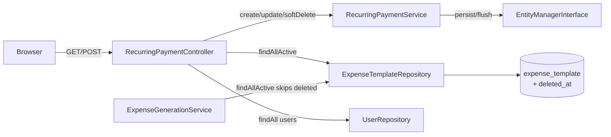

# Requirements

### Overview & Goals
Add a **Recurring Payments** CRUD page to the budgeting app. Users can create, view, inline-edit, and soft-delete recurring payment definitions (`ExpenseTemplate`) that drive monthly expense generation.

### Scope
**In Scope**
- New nav link: Dashboard → Monthly Ledger → **Recurring Payments** → All-Time Balance
- `GET /recurring-payments` — list all active templates (alphabetical)
- `POST /recurring-payments/new` — create
- `POST /recurring-payments/{id}/edit` — inline edit (per-row save button)
- `POST /recurring-payments/{id}/delete` — soft-delete (sets `deletedAt`)
- Symfony `FormType` for create & edit with field-level validation
- Split ratio displayed as **"User A 75% – User B 25%"** in the table
- Soft-delete prevents future generation; historical `Expense` rows preserved
- Edit only affects future generation — no retroactive changes
- Schema migration to add `deleted_at` column to `expense_template`

**Out of Scope**
- Retroactive regeneration of existing monthly expenses
- PHPUnit tests (none currently exist in the project)
- CSRF (deferred)

### User Stories
- As a user, I want to see all my recurring payment templates so I can manage them easily.
- As a user, I want to create a new recurring payment (fixed or variable) so future months include it automatically.
- As a user, I want to inline-edit a recurring payment row so I can correct details without leaving the page.
- As a user, I want to soft-delete a recurring payment so it stops generating new expenses without losing history.

### Functional Requirements
 # | Requirement |
---|-------------|
 F1 | Nav bar: "Recurring Payments" link inserted between Monthly Ledger and All-Time Balance |
 F2 | List page columns: Title, Default Amount, Paid By, Split Ratio (% format), Payment Type, Actions |
 F3 | Empty state shown when no active templates exist |
 F4 | Create/edit form validates: title (required, max 255), amount (required for Fixed; optional/preserved for Variable; ≥0, 2dp), paid-by (required, must exist), split ratio (required, 0–1, 2dp) |
 F5 | Fixed → `isStatic=true`; Variable → `isStatic=false` |
 F6 | Switching to Variable keeps any entered amount as optional (not cleared) |
 F7 | Inline edit expands a row; save button belongs to that row only |
 F8 | Delete uses POST + browser `confirm()` dialog |
 F9 | Soft-delete sets `deletedAt`; generation skips soft-deleted templates |
 F10 | Editing a template never touches already-generated `Expense` rows |
 F11 | Flash success messages on create, edit, delete |
 F12 | Light and dark themes both work |

# Technical Design

### Current Implementation
- **`ExpenseTemplate`** (id, title, defaultAmount, isStatic, paidBy→User, defaultSplitRatio) — no soft-delete yet.
- **`Expense.template`** is a nullable `ManyToOne` FK with **no cascade** — safe; hard-deleting a template would violate the FK, soft-delete avoids this entirely.
- **`ExpenseGenerationService::generateMonthlyPlaceholders()`** calls `$this->templateRepository->findAll()` — must be updated to exclude soft-deleted rows.
- **Controllers** are thin, delegate to services. Pattern: inject service via method params or constructor.
- **Templates** extend `base.html.twig`. Inline per-row form + save already used in `ledger/index.html.twig`.

### Key Decisions
 Decision | Choice | Rationale |
----------|--------|-----------|
 Delete strategy | Soft-delete (`deleted_at` column) | User confirmed; FK on `Expense.template_id` stays valid |
 Edit UX | Inline per-row (JS toggle hidden form row) | User preference; mirrors ledger inline-save pattern |
 Form handling | Symfony `FormType` + validation constraints | User preference; maintainable |
 Split ratio display | "User A X% – User B Y%" | User preference |
 Retroactive edit | None — future generation only | User confirmed |

### Proposed Changes

#### Entity — `ExpenseTemplate` (add `deletedAt`)
```php
#[ORM\Column(nullable: true)]
private ?\DateTimeImmutable $deletedAt = null;
// + getDeletedAt() / softDelete() methods
```

#### Repository — `ExpenseTemplateRepository`
```php
public function findAllActive(): array {
    return $this->createQueryBuilder('t')
        ->where('t.deletedAt IS NULL')
        ->orderBy('t.title', 'ASC')
        ->getQuery()->getResult();
}
```

#### Service — `RecurringPaymentService`
```php
class RecurringPaymentService {
    public function __construct(private EntityManagerInterface $em) {}
    public function create(array $data): ExpenseTemplate { … }
    public function update(ExpenseTemplate $t, array $data): void { … }
    public function softDelete(ExpenseTemplate $t): void {
        $t->setDeletedAt(new \DateTimeImmutable());
        $this->em->flush();
    }
}
```

#### FormType — `RecurringPaymentType`
Fields: `title` (TextType), `defaultAmount` (NumberType, nullable), `isStatic` (ChoiceType), `paidBy` (EntityType→User), `defaultSplitRatio` (NumberType).
Conditional `NotBlank` on `defaultAmount` when `isStatic=true` via a `POST_SUBMIT` callback or custom `Callback` constraint.

#### Controller — `RecurringPaymentController`
- `GET /recurring-payments` → list + empty create form
- `POST /recurring-payments/new` → create, flash, redirect
- `POST /recurring-payments/{id}/edit` → update, flash, redirect
- `POST /recurring-payments/{id}/delete` → soft-delete, flash, redirect

#### `ExpenseGenerationService`
Replace `findAll()` with `findAllActive()`.

### File Structure
```
src/
  Controller/RecurringPaymentController.php   ← NEW
  Form/RecurringPaymentType.php               ← NEW
  Service/RecurringPaymentService.php         ← NEW
  Entity/ExpenseTemplate.php                  ← MODIFIED
  Repository/ExpenseTemplateRepository.php    ← MODIFIED
  Service/ExpenseGenerationService.php        ← MODIFIED
templates/
  recurring_payment/
    index.html.twig                           ← NEW
    _form.html.twig                           ← NEW
  base.html.twig                              ← MODIFIED (nav link)
migrations/
  VersionXXXX.php                             ← NEW (deleted_at column)
```

### Architecture Diagram


### Risks
- **FK safety:** Soft-delete leaves the row in place so `expense.template_id` FK is never violated.
- **Inline JS:** Simple `display:none` toggle; no build step needed (project uses AssetMapper, no heavy JS framework).

# Delivery Steps

### ✓ Step 1: Update RecurringPaymentManagement.txt spec to reflect finalized decisions
The spec file at `migrations/RecurringPaymentManagement.txt` is updated to match all decisions made during planning, so the implementation agent works from an accurate reference.

- Open `migrations/RecurringPaymentManagement.txt` and apply the following targeted changes:
  - **EDIT UX:** Replace the sentence "Add an edit operation, either inline on the main page or through a separate edit page" with "Add an edit operation inline on the main page. The save button must appear on the specific row being edited, not as a single master save button."
  - **VARIABLE AMOUNT:** In the DEFAULT AMOUNT validation section, replace "Optional for variable recurring payments" with "Optional for variable recurring payments. If the user switches to variable type and has already entered an amount, preserve the value and treat it as optional — do not clear or reject it."
  - **SPLIT RATIO DISPLAY:** In the table columns list (LIST section), change "Split ratio" to "Split ratio (displayed as \"User A X% – User B Y%\" e.g. \"User A 75% – User B 25%\")"
  - **DELETE STRATEGY:** Replace the paragraph beginning "Before implementing deletion, inspect the Doctrine relationship..." with: "Delete operations must use a soft-delete strategy. Add a `deletedAt` nullable `DateTimeImmutable` column to `ExpenseTemplate`. Setting this field marks the record as deleted. The hard row must never be removed. Schema changes and a new Doctrine migration are required and acceptable."
  - **CSRF:** In the SECURITY AND REQUEST HANDLING section, mark CSRF as deferred: append "(CSRF is deferred and not required for this implementation.)" after the CSRF bullet.
  - **TESTS:** Replace the entire TESTS section with: "TESTS\n\nNo PHPUnit tests are required. No test infrastructure currently exists in the project. Structure the code for future testability but do not write any test files."
  - **MONTHLY GENERATION:** In rule 4 under MONTHLY GENERATION COMPATIBILITY, append the clarification: "Edits must only affect future generation. No retroactive changes to already-generated Expense records are permitted."

### ✓ Step 2: Add soft-delete to ExpenseTemplate and update generation service
ExpenseTemplate gains a `deletedAt` column and the generation service skips soft-deleted templates.

- Add `deletedAt` nullable `DateTimeImmutable` property with getter and `softDelete()` setter to `src/Entity/ExpenseTemplate.php`
- Generate a new Doctrine migration adding `deleted_at DATETIME DEFAULT NULL` to `expense_template`
- Add `findAllActive(): array` to `src/Repository/ExpenseTemplateRepository.php` — filters `deletedAt IS NULL`, orders by `title ASC`
- Update `src/Service/ExpenseGenerationService.php` to call `findAllActive()` instead of `findAll()`

### ✓ Step 3: Create RecurringPaymentType FormType and RecurringPaymentService
A reusable FormType and a service encapsulating create/update/soft-delete business logic are ready for the controller.

- Create `src/Form/RecurringPaymentType.php`: fields — `title` (TextType, NotBlank, Length max 255), `defaultAmount` (NumberType, nullable, GreaterThanOrEqual 0), `isStatic` (ChoiceType Fixed/Variable), `paidBy` (EntityType→User, NotBlank), `defaultSplitRatio` (NumberType, NotBlank, Range 0–1)
- Add a `Callback` or `POST_SUBMIT` event constraint enforcing `defaultAmount` is required when `isStatic=true`; when `isStatic=false` the value is preserved and treated as optional
- Create `src/Service/RecurringPaymentService.php` with constructor-injected `EntityManagerInterface`; methods: `create()`, `update()`, `softDelete()`

### ✓ Step 4: Implement RecurringPaymentController with all four routes
All four routes are functional: list, create, inline edit, and soft-delete.

- Create `src/Controller/RecurringPaymentController.php` extending `AbstractController`
- `index()` on `GET /recurring-payments` (`app_recurring_payments`): fetch active templates, build empty create form, render `recurring_payment/index.html.twig`
- `create()` on `POST /recurring-payments/new`: handle FormType submission, call `RecurringPaymentService::create()`, add success flash, redirect to `app_recurring_payments`
- `edit()` on `POST /recurring-payments/{id}/edit`: load template (404 if missing), handle FormType, call `RecurringPaymentService::update()`, add success flash, redirect
- `delete()` on `POST /recurring-payments/{id}/delete`: load template (404 if missing), call `RecurringPaymentService::softDelete()`, add success flash, redirect

### ✓ Step 5: Build Twig templates and update navigation
The Recurring Payments page is fully rendered with create form, table, inline edit UX, empty state, and correct nav position.

- Create `templates/recurring_payment/_form.html.twig`: reusable partial rendering all form fields, field-level validation errors, using existing inline-style CSS pattern from `dashboard/index.html.twig`
- Create `templates/recurring_payment/index.html.twig`: extends `base.html.twig`; flash message block; page heading + description card; create form card using `_form.html.twig`; table with columns — Title, Default Amount, Paid By, Split Ratio ("X% – Y%"), Payment Type, Actions; per-row inline-edit form (hidden by default, toggled with a small JS snippet, save button on the row); POST confirm-dialog delete button; empty state card when no active templates exist
- Update `templates/base.html.twig` nav: insert `<a href="{{ path('app_recurring_payments') }}">Recurring Payments</a>` between the Monthly Ledger and All-Time Balance links